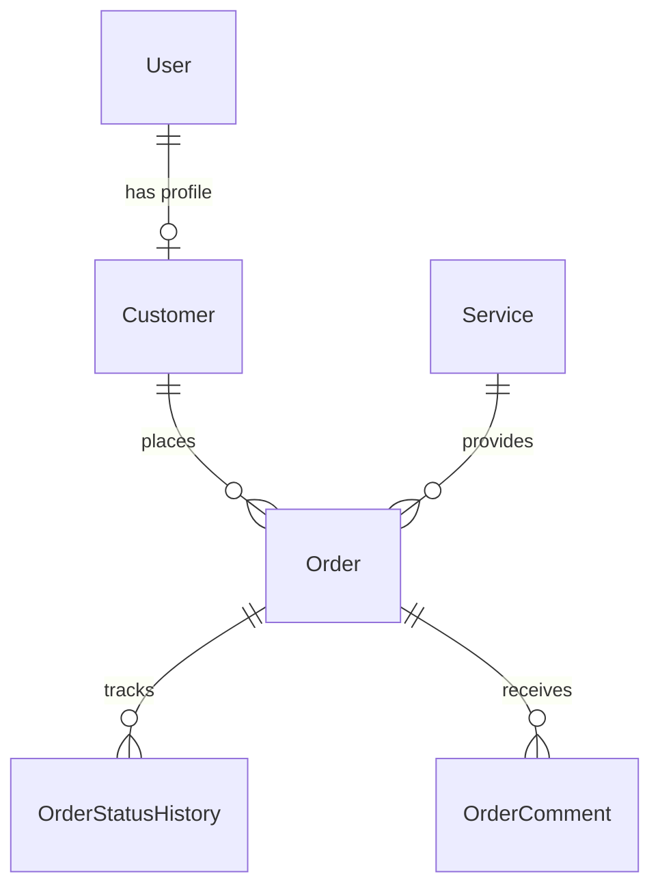
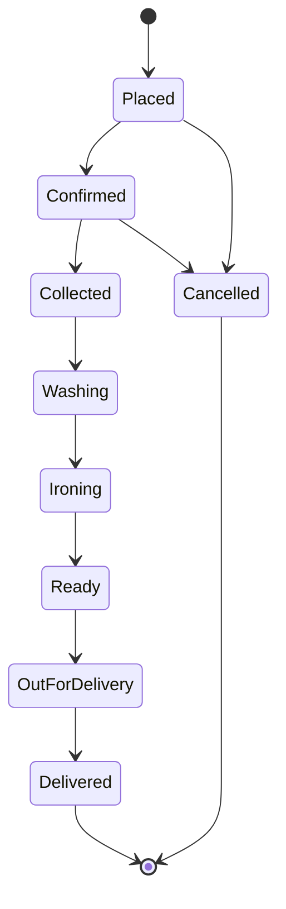

# 🧺 LaundryConnect Kenya

[](https://python.org)
[](LICENSE)
[](https://github.com)

> **A comprehensive command-line laundry management system built for Kenyan laundry businesses**

LaundryConnect Kenya is a full-featured CLI application that digitizes laundry service operations, providing both customer self-service capabilities and comprehensive staff management tools. Built with Python and SQLAlchemy, it offers real-time order tracking, automated pricing, and detailed business analytics.

## 🔗 Useful Links

- [Demo Video](https://www.youtube.com/watch?v=your-demo-video-link)
- [GitHub Repository](https://github.com/yourusername/laundry-connect-kenya)
- [Project Website / Live Demo](https://laundryconnect.co.ke)
- [Author Profile](https://github.com/yourusername)
- [Database Diagram](https://dbdiagram.io/d/68343b300240c65c4438de5f)


## 🌟 Key Features

### 👥 Customer Portal
- Secure User Registration & Authentication
- Self-Service Order Placement with weight estimation
- GPS Location Management for pickup/delivery
- Real-Time Order Tracking through complete laundry lifecycle
- Service Reviews & Ratings system
- Transparent Pricing with automatic calculations
- Complete Order History with detailed breakdowns

### 👨‍💼 Staff & Admin Portal
- Comprehensive Order Management with status updates
- Weight & Price Adjustments after collection
- Customer Profile Management 
- Service Configuration with tiered pricing (Standard/Express/Premium)
- Advanced Reporting (Daily, Revenue, Customer Analytics)
- Pickup Scheduling and route optimization
- Internal Notes and communication tools

### 🔧 Technical Features
- Robust Database Design with SQLAlchemy ORM
- Secure Authentication with password hashing
- Rich Data Analytics and business intelligence
- Status History Tracking with timestamps
- Dynamic Pricing Engine with service multipliers
- Location-Based Services with coordinate storage

## 🚀 Installation

### Prerequisites
- Python 3.8 or higher
- pip (Python package manager)
- Git

### Quick Start

1. Clone the repository
   ```bash
   git clone https://github.com/yourusername/laundry-connect-kenya.git
   cd laundry-connect-kenya
   ```

2. Set up virtual environment
   ```bash
   python -m venv venv
   source venv/bin/activate  # On Windows: venv\Scripts\activate
   ```

3. Install dependencies
   ```bash
   pip install -r requirements.txt
   # OR using pipenv
   pip install pipenv
   pipenv install
   pipenv shell
   ```

4. Initialize Alembic migrations (if not already initialized)
   ```bash
   cd lib/db
   alembic init migrations
   ```

5. Modify Alembic configuration as needed and start development.

6. To create database tables, run:
   ```bash
   python lib/cli.py
   ```
   The application will create tables if they do not exist.

## 📖 Usage Guide

Run the CLI application:
```bash
python lib/cli.py
```

Follow the on-screen menus to manage customers, orders, services, locations, and generate reports.

## 🗂️ Project Structure

```
laundry-connect-kenya/
│
├── lib/
│   ├── models/                 # Database models
│   │   ├── __init__.py
│   │   ├── base.py            # Database connection
│   │   ├── user.py            # User authentication
│   │   ├── customer.py        # Customer profiles
│   │   ├── service.py         # Service definitions
│   │   ├── order.py           # Order management
│   │   ├── location.py        # Business locations
│   │   ├── order_status_history.py
│   │   └── order_comment.py
│   ├── db/
│   │   ├── models.py
│   │   ├── init_db.py
│   │   └── seed.py            # Sample data generation
│   ├── cli.py                 # Main application interface
│   └── helpers.py             # Business logic functions
├── requirements.txt           # Python dependencies
├── Pipfile                    # Pipenv configuration
├── README.md                  # This file
└── LICENSE                   # MIT License
```

## 🗄️ Database Schema

### Core Entities

| Table | Purpose | Key Features |
|-------|---------|--------------|
| `users` | Authentication & roles | Secure password hashing, role-based access |
| `customers` | Customer profiles | Location data, contact information |
| `services` | Service definitions | Tiered pricing, turnaround times |
| `orders` | Order management | Status tracking, pricing calculations |
| `order_status_history` | Audit trail | Complete lifecycle tracking |
| `order_comments` | Customer feedback | Notes and comments |
| `locations` | Business locations | Multi-branch support |

### Entity Relationships



## 🔐 Authentication & Security

### User Roles
- Customer: Self-service portal access
- Staff: Order management and customer service
- Admin: Full system access and configuration

### Security Features
- SHA-256 password hashing with unique salts
- Session-based authentication
- Role-based access control
- Input validation and sanitization

## 💰 Service Pricing

### Service Tiers

| Tier | Multiplier | Description | Turnaround |
|------|------------|-------------|------------|
| Standard | 1.0x | Regular service | 48 hours |
| Express | 1.5x | Priority processing | 24 hours |
| Premium | 2.0x | Luxury care | 72 hours |

### Price Calculation
```python
base_price = service.price_per_unit * actual_weight
final_price = base_price * service_tier_multiplier
```

## 📊 Reporting & Analytics

### Available Reports
- Daily Orders: Revenue and volume by date
- Customer Analytics: Top customers, spending patterns
- Service Performance: Popular services, revenue by type
- Pickup Scheduling: Upcoming collections and deliveries
- Revenue Trends: Historical financial performance

## 🚦 Order Lifecycle



## 🧪 Sample Data

The application includes rich sample data for testing:

### Demo Accounts
| Role | Username | Password | Description |
|-------|----------|----------|-------------|
| Admin | admin | admin123 | Full system access |
| Staff | staff1 | staff123 | Order management |
| Customer | john_doe | password123 | Sample customer |
| Customer | jane_smith | password123 | Sample customer |

### Sample Services
- Standard Wash & Iron - KSH 200/kg
- Express Service - KSH 350/kg  
- Dry Cleaning - KSH 500/item
- Bedding & Linens - KSH 250/kg
- Delicate Garments - KSH 400/item

## 🛠️ Development

### Prerequisites for Development
- Python 3.8+
- SQLAlchemy knowledge
- CLI application experience

### Setting up Development Environment
```bash
# Clone and setup
git clone https://github.com/yourusername/laundry-connect-kenya.git
cd laundry-connect-kenya

# Install development dependencies
pipenv install --dev

# Run tests (if available)
python -m pytest tests/

# Start development server
python lib/cli.py
```

### Adding New Features
1. Define database models in `lib/models/`
2. Add business logic to `lib/helpers.py`
3. Update CLI interface in `lib/cli.py`
4. Test with sample data from `lib/db/seed.py`

## 🤝 Contributing

We welcome contributions! Please follow these steps:

1. Fork the repository
2. Create a feature branch (`git checkout -b feature/amazing-feature`)
3. Commit your changes (`git commit -m 'Add amazing feature'`)
4. Push to the branch (`git push origin feature/amazing-feature`)
5. Open a Pull Request

### Code Style
- Follow PEP 8 Python style guidelines
- Use meaningful variable and function names
- Add docstrings for new functions
- Include type hints where appropriate

## 📋 Requirements

### System Requirements
- OS: Windows, macOS, Linux
- Python: 3.8 or higher
- RAM: 512 MB minimum
- Storage: 100 MB for application and data

### Python Dependencies
```
sqlalchemy>=1.4.0
tabulate>=0.9.0
alembic>=1.7.0
```

## 🚀 Future Enhancements

### Planned Features
- Mobile App Integration
- Payment Gateway Integration (M-Pesa, Card payments)
- Email/SMS Notifications
- Web Dashboard
- Advanced Analytics Dashboard
- Route Optimization
- QR Code Order Tracking
- WhatsApp Bot Integration

### Technical Roadmap
- REST API development
- Docker containerization  
- Cloud deployment (AWS/Digital Ocean)
- Real-time notifications
- Mobile-responsive web interface

## 🐛 Troubleshooting

### Common Issues

**Import Errors:**
```bash
# If you see "ModuleNotFoundError"
export PYTHONPATH="${PYTHONPATH}:$(pwd)"
python lib/cli.py
```

**Database Issues:**
```bash
# Reset database
rm laundryconnect.db
python lib/cli.py  # Select option 3 to reseed
```

**Permission Errors:**
```bash
# Ensure proper file permissions
chmod +x lib/cli.py
```

## 📞 Support & Contact

### Getting Help
- Email: support@laundryconnect.co.ke
- Bug Reports: [GitHub Issues](https://github.com/yourusername/laundry-connect-kenya/issues)
- Discussions: [GitHub Discussions](https://github.com/yourusername/laundry-connect-kenya/discussions)

### Business Inquiries
- Phone: +254 700 123456
- Address: Nairobi, Kenya
- Website: www.laundryconnect.co.ke

## 📄 License

This project is licensed under the MIT License - see the [LICENSE](LICENSE) file for details.

---

<div align="center">

**Built with ❤️ for Kenyan Entrepreneurs**

[⭐ Star this project](https://github.com/yourusername/laundry-connect-kenya) | [🐛 Report Bug](https://github.com/yourusername/laundry-connect-kenya/issues) | [💡 Request Feature](https://github.com/yourusername/laundry-connect-kenya/issues)

</div>

---

> **"Digitizing laundry services, one wash at a time."** 🧺✨
